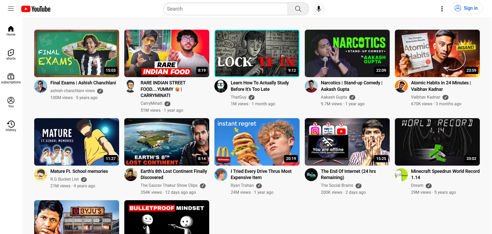

# 🎥 Mini YouTube Clone

  A small web-based YouTube clone showcasing 12 videos. Search for videos and watch them directly on the site! ✨

## ⚡ Features

  - 🎬 Display of 12 YouTube videos

  - 🔍 Search functionality to quickly find videos

  - 🖥️ Watch videos directly from the site

  - 📱 Responsive design – works on desktop, tablet, and mobile

## 🚀 How to Use

1. Clone the repository:

    ```bash

    git clone https://github.com/Harsimrankaur2004/youtube-clone


2. Open index.html in your browser 🌐

3. Browse the videos and use the search bar to find any video 🔍

## 🌟 Demo

   [View Live Demo](https://youtube-clone-website-projectt.netlify.app/)

## 📸 Screenshot

  

## 🛠️ Tech Stack

  - HTML5 & CSS3

  - JavaScript

## 💡 Notes

  - This is a mini project, only 12 videos are included.

  - Search works only within the provided videos.


  - Fully responsive for all devices.

## 📜 License

   This project is licensed under the MIT License — you’re free to use and modify it.


   [](https://opensource.org/licenses/MIT)

